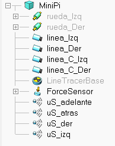
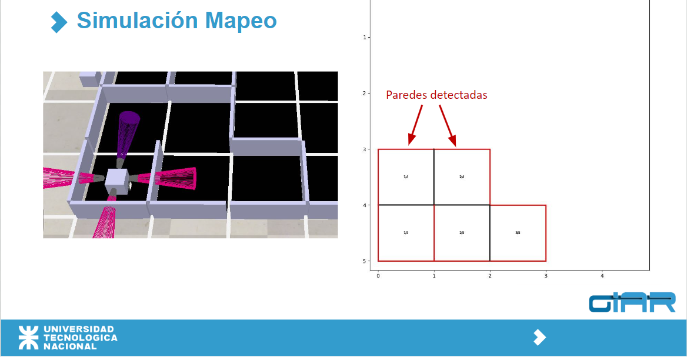
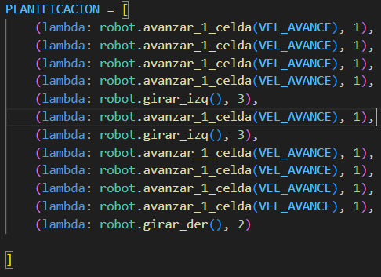

# 🚀 Fusión de Sensores: Entorno Simulado
**[Bryan A. Battagliese Montiel](https://www.linkedin.com/in/bryan-battagliese-5a868627b/) - [GIAR UTN FRBA 2024](https://linktr.ee/giarutn?fbclid=PAZXh0bgNhZW0CMTEAAaYG3taTLmEOIiv-Z8yuxECL3pAB_2dw4--xXbzYpIDobJ7wusQPSweCSHA_aem_6bu8xvLWcwnQb9IsmBceXw)**

## 🛠️ Entorno de Trabajo

Actualmente utilizamos **CoppelliaSIM**, un software de simulación robótica que permite diseñar y probar entornos de simulación complejos de manera rápida y flexible. Cuenta con un motor de simulación distribuida, que permite controlar distintos elementos de una simulación a través de múltiples scripts (como Python, C++, MATLAB).

En nuestro caso, elegimos **Python** por su facilidad y flexibilidad, además de la amplia variedad de bibliotecas accesibles 🐍.

Basado en las premisas del **Robot Planning**, contamos con un espacio estructurado con mosaicos/celdas (en este caso elegimos un tamaño de 5x5). [🔗 Fusion de sensores - MINIPI.ttt](https://github.com/BryanBattagliese/fusion_de_sensores_simulacion/blob/main/Fusion%20de%20sensores%20-%20MINIPI.ttt).

El robot utilizado es una representación del **MiniPi** 🤖. Este cuenta con 4 sensores de ultrasonido (uno en cada cara del cubo); 4 sensores de línea; y un "force-sensor" encargado de mover sus 2 ruedas.  

## 🎯 Objetivo del Trabajo

El objetivo principal es tener un entorno simulado en el cual el robot MiniPi sea capaz de llegar desde una celda A hasta una celda B, mapeando su entorno y reconociendo paredes/obstáculos a través de sus sensores de ultrasonido 🛑. Es importante poder recolectar estos datos y representarlos 📊.

El MiniPi puede trabajar de dos diferentes maneras:

### 🅰️ - "Acatando ordenes concretas"

Se le pasa al robot MiniPi una serie de instrucciones simples, que debe ejecutar en serie. Una vez finalizado, muestra lo que pudo mapear (es capaz de mostrar el mapeo en "tiempo real") 📍.
En caso de no poder cumplir con alguna de sus instrucciones, frena y pregunta por consola que debe hacer.

Las instrucciones simples que entiende nuestro robot son:  
- `avanzar_1_celda` 🔄
- `girar_der` ➡️
- `girar_izq` ⬅️
- `centrar` 🎯

[🔗 Biblioteca de funciones: minipi_lib.py](minipi_lib.py)

[🔗 Video: explicacion sobre este caso ](https://drive.google.com/drive/u/1/folders/1jOXsJzJ1Tr4iW5LoqXvL4d1WHVyuWoES)

### 🅱️ - "Siendo independiente"

Se ha desarrollado un algoritmo de tipo "A-STAR" con el objetivo de que el MINIPI sea capaz de poder calcular la mejor ruta para llegar desde 'A' hasta 'B'.

¿Por que A-STAR?
- Es muy eficiente: utiliza una heurística (distancia Manhattan) para calcular la distancia a un objetivo/celda, evitando caminos innecesarios. La heuristica funciona como una "pista" sobre la ubicacion del objetivo.
- Tiempo de busqueda reducido: comparandolo con un algoritmo de tipo Dijkstra.
- Perfecto para laberintos pequeños: consume poca memoria; busca solamente el camino mas corto en lugar de calcular rutas a TODOS los nodos (Dijkstra).

*💡 Nota: En cualquiera de los casos, si el MiniPi detecta algún obstáculo o algo que impidiera seguir con su ejecución, se frena y espera que se le indiquen los pasos a seguir desde la consola de desarrollador.*

## 📂 Información sobre los Archivos del Repositorio

- **Fusion de sensores - MINIPI.ttt**: Es la escena en el simulador CoppelliaSIM.

- **fusion_de_sensores.py**: Es el archivo principal en Python. Aquí se conecta con el simulador y ejecuta lo que se le indique. *(Dentro del "if")*

- **minipi_lib.py**: Biblioteca de funciones que adaptan las funcionalidades del simulador para poder ser utilizadas en nuestro programa .py.

  *💡 Nota: Las primeras líneas de código en estos dos programas son variables necesarias, importación de librerías, y obtención de los controladores (handlers) de todos los componentes del robot en el simulador.*

- **mapeo/mapa.py**: Programa creado utilizando **Matplotlib**, con el objetivo de mostrar los mapeos realizados por el MiniPi en forma de mapas/laberintos.

- **remoteApi.dll**
- **remoteApi.so**
- **sim.py**
- **simConst.py**

  Estos últimos cuatro son archivos de configuración necesarios para la vinculación del simulador CoppelliaSIM con el programa en Python.

*💡 Nota: Actualmente se encuentra en desarrollo un algoritmo que permita la búsqueda y ejecución del mejor camino para llegar desde una celda A hasta una celda destino B (caso "B" mencionado anteriormente).* 🔍

## Links relacionados 
🎬[Ejecucion completa(mapeo+navegación)](https://drive.google.com/drive/u/1/folders/1jOXsJzJ1Tr4iW5LoqXvL4d1WHVyuWoES)

🎬[Presentación del proyecto "Fusion de sensores"](https://www.youtube.com/watch?v=KTsziHjEZVk&t=2013s)
